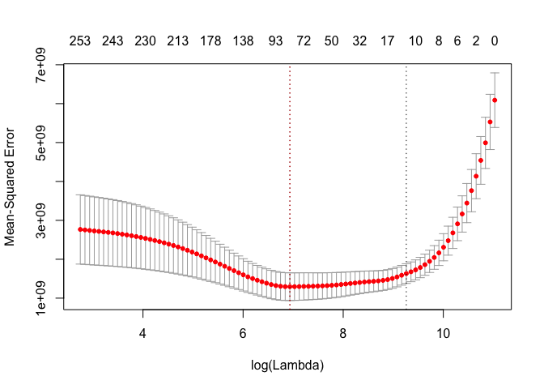
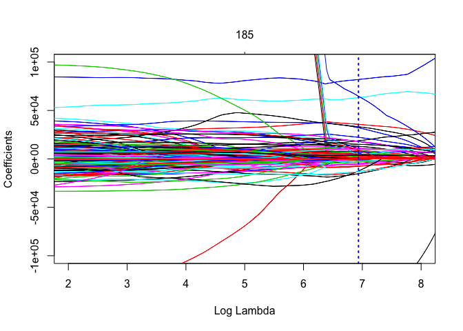

\#\#Introduction This is one of my first attempts at data analysis and
predictive modelling for the Ames Housing dataset of the [*House Prices:
Advanced Regression
Techniques*](https://www.kaggle.com/c/house-prices-advanced-regression-techniques)
training competition on Kaggle.

I chose this dataset because housing prices prediction is a very common
machine learning problem used in teaching and algorithm benchmarking.
[The textbook](http://www-bcf.usc.edu/~gareth/ISL/) that I used to study
statistical learning features lots of examples with a pretty well-known
[Boston housing
dataset](http://www.cs.toronto.edu/~delve/data/boston/bostonDetail.html).
The Ames Housing dataset is described on Kaggle as “a modernized and
expanded version of the often cited Boston Housing dataset”. After
spending quite some time working on practice problems from the textbook,
creating a predictive model for the Ames Housing dataset seemed like a
natural progression.

The choice of a linear regression model was due to the fact that linear
models are much easier to interpret. Apart from predicting housing
prices, my goal was to infer what features are important for this task.
It turned out, it is hard to pinpoint what are the only important
features exactly because of the presence of highly collinear predictors
in the dataset and the inherent randomness of the lasso analysis method.

Nevertheless, this analysis provides a good demonstration of how the
lasso works, and the final model performs quite well on the test dataset
(top \~50% at the moment of writing).

\#\#Data Preprocessing Load the dataset.

``` r
data.train <- read.csv("train.csv", header=T)
data.test <- read.csv("test.csv", header=T)
data.test$SalePrice <- 0 #Make test prices 0 for now a single data table can be created
data <- rbind(data.train, data.test)
```

\#\#\#Replacing NAs These are all the variables that have at least one
missing observation.

``` r
varsWithNA <- names(which(colSums(is.na(data))>0))
varsWithNA
```

    ##  [1] "MSZoning"     "LotFrontage"  "Alley"        "Utilities"   
    ##  [5] "Exterior1st"  "Exterior2nd"  "MasVnrType"   "MasVnrArea"  
    ##  [9] "BsmtQual"     "BsmtCond"     "BsmtExposure" "BsmtFinType1"
    ## [13] "BsmtFinSF1"   "BsmtFinType2" "BsmtFinSF2"   "BsmtUnfSF"   
    ## [17] "TotalBsmtSF"  "Electrical"   "BsmtFullBath" "BsmtHalfBath"
    ## [21] "KitchenQual"  "Functional"   "FireplaceQu"  "GarageType"  
    ## [25] "GarageYrBlt"  "GarageFinish" "GarageCars"   "GarageArea"  
    ## [29] "GarageQual"   "GarageCond"   "PoolQC"       "Fence"       
    ## [33] "MiscFeature"  "SaleType"

Remove variables that are missing from &gt;90% of all observations.

``` r
names(data[colSums(is.na(data))/nrow(data) > 0.9])
```

    ## [1] "Alley"       "PoolQC"      "MiscFeature"

``` r
data["MiscFeature"] <- NULL # Missing value in 96.4% of observations
data["Alley"] <- NULL # Missing value in 93.2% of observations
data["PoolQC"] <- NULL # Missing value in 99.7% of observations
```

Divide nominal and ordinal variables that have missing values into
following categories:

-   Missing Observations (cannot make assumptions about the value; mark
    as “MissingObs”)
-   Effectively Absent (assume that NA means the feature is absent; mark
    as “None”)

Divide continuous and discrete variables that have missing values into
following categories:

-   Missing Numerical Observations (cannot make assumptions about the
    value; mark as -1)
-   Effectively Zero (assume that NA means the feature is absent,
    meaning effective size is 0; mark as 0)

``` r
missingObs <- c("MSZoning", "MasVnrType", "Utilities", "Exterior1st", "Exterior2nd", "SaleType")
effZero <- c("LotFrontage", "MasVnrArea", "BsmtFinSF1", "BsmtFinSF2", "BsmtUnfSF", "TotalBsmtSF","GarageCars", "GarageArea", "BsmtFullBath", "BsmtHalfBath")

# Get Effectively Absent category by excluding other categories from varsWithNA
effAbsent <- varsWithNA[!varsWithNA %in% missingObs]
effAbsent <- effAbsent[!effAbsent %in% effZero]
effAbsent <- effAbsent[!effAbsent %in% c("Functional", "GarageYrBlt")]

# Function for replacing NAs in nominal and ordinal variables
replaceNAfactor = function(data.col, factorString){
  char.col <- as.character(data.col)
  char.col[which(is.na(data.col))] <- factorString
  as.factor(char.col)
}
# Replace NAs with None in Effectively Absent category
for (i in 1:ncol(data)){
  if(names(data[i]) %in% effAbsent){
    data[,i] <- replaceNAfactor(data[,i], "None")}
}
# Replace NAs with MissingObs in Missing Observations category
for (i in 1:ncol(data)){
  if(names(data[i]) %in% missingObs){
    data[,i] <- replaceNAfactor(data[,i], "MissingObs")}
}
# Replace NAs with 0 in Effectively Zero category
for (i in 1:ncol(data)){
  if(names(data[i]) %in% effZero)
    data[is.na(data[,i]),i] <- 0
}
# Replace NA with -1 in Missing Numerical Observations category
data$GarageYrBlt[is.na(data$GarageYrBlt)] <- -1
```

Variable *Functional* is a bit special. There is a following comment
about this variable in the
[DataDocumentation.txt](https://ww2.amstat.org/publications/jse/v19n3/decock/DataDocumentation.txt)
file:

    Functional (Ordinal): Home functionality (Assume typical unless deductions are warranted)

Therefore, assume that NA for variable *Functional* means “Typ”.

``` r
data$Functional <- replaceNAfactor(data$Functional, "Typ")
```

Make sure that NAs are replaced in every variable.

``` r
names(which(colSums(is.na(data))>0))
```

    ## character(0)

### Encoding Variables to Correct Types

Refer to
[DataDocumentation.txt](https://ww2.amstat.org/publications/jse/v19n3/decock/DataDocumentation.txt)
for help with variable encoding.

*MSSubClass* is not a discrete variable. It is a nominal variable that
identifies a type of a house.

``` r
data$MSSubClass <- as.factor(data$MSSubClass)
```

There are 22 ordinal variables in the dataset. Manually specify the
order of factor levels for each variable.

``` r
data$LotShape <- ordered(data$LotShape, levels=c("IR3", "IR2", "IR1", "Reg"))
data$Utilities <- ordered(data$Utilities, levels=c("MissingObs", "NoSeWa", "NoSewr", "AllPub"))
data$LandSlope <- ordered(data$LandSlope, levels=c("Gtl", "Mod", "Sev"))
data$OverallQual <- ordered(data$OverallQual)
data$OverallCond <- ordered(data$OverallCond)
data$ExterQual <- ordered(data$ExterQual, levels=c("Po", "Fa", "TA", "Gd", "Ex"))
data$ExterCond <- ordered(data$ExterCond, levels=c("Po", "Fa", "TA", "Gd", "Ex"))
data$BsmtQual <- ordered(data$BsmtQual, levels=c("None", "Po", "Fa", "TA", "Gd", "Ex"))
data$BsmtCond <- ordered(data$BsmtCond, levels=c("None", "Po", "Fa", "TA", "Gd", "Ex"))
data$BsmtExposure <- ordered(data$BsmtExposure, levels=c("None", "No", "Mn", "Av", "Gd"))
data$BsmtFinType1 <- ordered(data$BsmtFinType1, levels=c("None", "Unf", "LwQ", "Rec", "BLQ", "ALQ", "GLQ"))
data$BsmtFinType2 <- ordered(data$BsmtFinType2, levels=c("None", "Unf", "LwQ", "Rec", "BLQ", "ALQ", "GLQ"))
data$KitchenQual <- ordered(data$KitchenQual, levels=c("None", "Po", "Fa", "TA", "Gd", "Ex"))
data$Functional <- ordered(data$Functional, levels=c("Sal", "Sev", "Maj2", "Maj1", "Mod", "Min2", "Min1", "Typ"))
data$FireplaceQu <- ordered(data$FireplaceQu, levels=c("None", "Po", "Fa", "TA", "Gd", "Ex"))
data$GarageFinish <- ordered(data$GarageFinish, levels=c("None", "Unf", "RFn", "Fin"))
data$GarageQual <- ordered(data$GarageQual, levels=c("None", "Po", "Fa", "TA", "Gd", "Ex"))
data$GarageCond <- ordered(data$GarageCond, levels=c("None", "Po", "Fa", "TA", "Gd", "Ex"))
data$PavedDrive <- ordered(data$PavedDrive, levels=c("N", "P", "Y"))
data$Fence <- ordered(data$Fence, levels=c("None", "MnWw", "GdWo", "MnPrv", "GdPrv"))
data$HeatingQC <- ordered(data$HeatingQC, levels=c("None", "Po", "Fa", "TA", "Gd", "Ex"))
data$Electrical <- ordered(data$Electrical, levels=c("None", "Mix", "FuseP", "FuseF", "FuseA", "SBrkr"))
```

\#\#Model Creation \#\#\#Model Training Regularized linear regression
model with lasso penalty from **glmnet** library will be used.

First, construct a design matrix from the data since **glmnet** needs
the data in this format; `model.matrix()` function can be used for that.
It’s important to note that `model.matrix()` doesn’t work as expected if
the data contains missing values, or values of types other than
numerical or quantitative.

``` r
set.seed(4)
labeled_data <- data[1:nrow(data.train),]
x <- model.matrix(SalePrice~.,labeled_data)[,-1] # Exclude Id column
y <- labeled_data$SalePrice
dim(x)
```

    ## [1] 1460  295

The constructed design matrix has 1460 rows (as expected; it’s the same
as the number of labeled observations) and 295 columns. There are more
columns than variables in the original data since `model.matrix()`
automatically transforms levels in qualitative variables into dummy
variables.

Plot standardized lasso coefficients as a function of ln(lambda).

``` r
library(glmnet)
```

    ## Loading required package: Matrix

    ## Loading required package: foreach

    ## Loaded glmnet 2.0-10

``` r
lambdas <- 10^seq(5,-3,length=10000) #may take some time to run; results in better plot resolution
lasso.mod <- glmnet(x,y,alpha=1,lambda=lambdas)
plot(lasso.mod, xvar="lambda")
```


Lasso penalty performs variable selection, therefore it can be seen that
many of the coefficients are reduced to zero when lambda is large (it
can be hard to see this clearly because of the large number of
coefficients).

\#\#\#Tuning Parameter Selection Use 80% of the provided training data
(labeled data) for choosing the most optimal tuning parameter lambda.
`cv.glmnet()` performs 10-fold cross-validation and provides lambda that
results in the smallest cross-validation error (marked with red line on
the plot). The other line (in black) marks the largest value of lambda
such that error is within 1 SE of the minimum.

``` r
train <- sample(nrow(data.train), nrow(data.train)*0.8)
cv.out <- cv.glmnet(x[train,],y[train],alpha=1)
best.lambda <- cv.out$lambda.min
plot(cv.out)
abline(v=log(best.lambda), col="red", lty=9)
```



``` r
best.lambda
```

    ## [1] 1027.054

*Note that results of `cv.glmnet()` are random, since folds are selected
at random. The [‘glmnet’
Documentation](https://cran.r-project.org/web/packages/glmnet/glmnet.pdf)
proposes a solution to this. The randomness can be reduced by running
`cv.glmnet()` many times and averaging the result. I found that this
randomness doesn’t have a significant effect on the end result (test
RMSE is effectively unchanged).*

Plot standardized lasso coefficients as a function of ln(lambda)
centered on the optimal value of lambda (marked by blue vertical line).

``` r
plot(lasso.mod, xvar="lambda", xlim=c(2,8), ylim=c(-100000,100000))
abline(v=log(best.lambda), col="blue", lwd=2, lty=9)
```


As expected, for the best lambda lasso yields a sparse model (many of
the coefficients are reduced to zero).

\#\#\#Sanity Check The sparse model trained using all the available
labeled data contains 55 nonzero coefficients. It is expected that lasso
selected significant variables (meaning they are the most useful
predictors of the house selling price).

``` r
coef <- predict(lasso.mod,type="coefficients",s=best.lambda, exact=T, x=x[train,], y=y[train])
coef.nonzero <- coef[as.vector(coef)>0,]
length(coef.nonzero)
```

    ## [1] 55

``` r
coef.nonzero
```

    ##             LotArea          StreetPave      LandContourLvl 
    ##            0.325268         1815.495545         4172.308368 
    ##    LotConfigCulDSac NeighborhoodClearCr NeighborhoodCrawfor 
    ##         9995.231722         4063.748060        20565.430834 
    ## NeighborhoodNoRidge NeighborhoodNridgHt NeighborhoodSomerst 
    ##        37534.467426        19845.290063         6425.776950 
    ## NeighborhoodStoneBr NeighborhoodVeenker      Condition1Norm 
    ##        20775.420097         2611.587022         6809.307163 
    ##    HouseStyle1Story       OverallQual.L       OverallQual.Q 
    ##         3997.699344        85612.594263        60581.149031 
    ##       OverallCond.L       OverallCond^5           YearBuilt 
    ##        30946.173209         1232.957312          109.117089 
    ##        YearRemodAdd     RoofMatlCompShg     RoofMatlMembran 
    ##           65.066682        14904.375581         8436.582477 
    ##     RoofMatlWdShngl  Exterior1stBrkFace  Exterior2ndCmentBd 
    ##        95739.201385        14781.058192         6721.629912 
    ##  Exterior2ndImStucc          MasVnrArea         ExterQual.L 
    ##        11880.380156           13.760520         7048.042837 
    ##          BsmtQual.L          BsmtQual.Q          BsmtQual.C 
    ##        17899.816627         6701.561233        11953.105679 
    ##          BsmtCond^5      BsmtExposure.L      BsmtExposure.Q 
    ##          512.917874        10374.209528         6293.991586 
    ##      BsmtFinType1.L      BsmtFinType1^4         HeatingQC.L 
    ##        11377.959727         1966.486244         4110.606919 
    ##         HeatingQC.Q         CentralAirY           GrLivArea 
    ##         1065.880595         1665.538350           40.393443 
    ##        BsmtFullBath            FullBath       KitchenQual.Q 
    ##         3850.045028         6058.414958        18976.548249 
    ##       KitchenQual.C        TotRmsAbvGrd        Functional.L 
    ##         4425.616895          776.420717        20206.450800 
    ##        Functional^4          Fireplaces    GarageTypeAttchd 
    ##         1057.711641         4481.335943          178.162923 
    ##      GarageFinish.Q          GarageCars          WoodDeckSF 
    ##          188.024989        10021.541940            7.441764 
    ##          X3SsnPorch         ScreenPorch         SaleTypeCon 
    ##           19.305675           17.734009        10816.501110 
    ##         SaleTypeNew 
    ##        14051.041640

It is possible to check subjectively if the selection makes sense.

*Note that I don’t claim that variables selected by the lasso are **the
only important variables** in the dataset. It is possible that there are
pairs of highly collinear predictors in the dataset, and the lasso picks
only one of them at random.*

-   It is expected that square footage of above ground living area
    (*GrLivArea*) is significant, since the physical size of the house
    is among the most important factors when purchasing a house.
-   Usually, high square footage is correlated with number of rooms in
    the house. Thus number of bathrooms (*BsmtFullBath*, *FullBath*) and
    total number of rooms (*TotRmsAbvGrd*) are important.
-   It seems logical that having a garage (*GarageTypeAttchd*) is more
    attractive to buyers in a small city (Ames population is 58,985 as
    of 2010), where a car is most likely the main mean of transportation
    for most people. Garage size (*GarageCars*) matters as well. *It’s
    likely that *GarageTypeAttchd* is highly collinear with all other
    garage types and was chosen by the lasso randomly.*
-   Only 7 out of 28 neighborhoods affected the price of the house
    significantly. This is understandable if we assume that most of the
    city’s neighborhoods have mixed-income housing.
-   Paved access to the property (*StreetPave*) is deemed significant by
    the model. It makes sense, if we assume that, in most cases, cheaper
    property on the outskirts of the city has gravel road access.
-   Cul-de-sac (*LotConfigCulDSac*) is the only lot configuration that
    affects the price significantly, according to the model. According
    to a study mentioned in this [news
    article](http://www.npr.org/templates/story/story.php?storyId=5455743)
    buyers pay 20% more for a home on a cul-de-sac.
-   The overall condition(*OverallCond.L *, *OverallCond^5*) and quality
    (*OverallQual.L*, *OverallQual.Q*) of the house, as well as
    condition and quality of separate areas (basement, exterior, kitchen
    etc.) of the house are significant, as expected.
-   Consequently, it is expected that a year a house was built in
    (*YearBuilt*) or remodelled (*YearRemodAdd*) would affect the
    condition of the house and, therefore, its price.
-   The style of the roof doesn’t seem to be important while the
    material does (*RoofMatlMembran*, *RoofMatlWdShngl*,
    *RoofMatlCompShg*). Makes sense from a practical point of view,
    assuming different materials have different durability.
-   The same goes for exterior material: stucco(*Exterior2ndImStucc*),
    brickface(*Exterior1stBrkFace*) and cement board(*Exterior2ndCmentBd
    *) are deemed significant.
-   Heating type doesn’t matter as long as it is in good condition
    (*HeatingQC.L*, *HeatingQC.Q*).
-   Brand new houses (*SaleTypeNew*) are expected to have higher prices
    than other sale types.

Not all non-zero variable coefficients were mentioned above, since I
can’t come up with a convincing arguments for some of them.
Nevertheless, it looks like variable selection that lasso performed
makes sense for the most part from a purely subjective point of view.

\#\#\#Model Testing The other 20% of the data that was held out from
model training are used to test how well the model performs for a chosen
lambda.

``` r
val <- -train
pred.val <- predict(lasso.mod,s=best.lambda ,newx=x[val,], exact=T, x=x[train,], y=y[train])
```

Compute test set mean-square error (MSE).

``` r
mean((pred.val-y[val])^2)
```

    ## [1] 695532591

Compute the fraction of (null) deviance explained by the full model
(good approximation of R^2). This linear model does a pretty good job of
explaining the variability of the training data (high fraction of
variance explained).

``` r
lasso.mod$dev.ratio[which.min(abs(lasso.mod$lambda-best.lambda))]
```

    ## [1] 0.8918716

Compute the test set bias.Positive bias means that the model tends to
overestimate the price. Negative bias means that the model tends to
underestimate the price.

``` r
mean(pred.val-y[val])
```

    ## [1] -2653.943

Compute maximum deviation. The worst prediction made by the model is off
by this amount in dollars.

``` r
max(abs(pred.val-y[val]))
```

    ## [1] 173434.2

Compute mean absolute deviation. On average, predictions are off by this
amount in dollars.

``` r
mean(abs(pred.val-y[val]))
```

    ## [1] 15693.7

Compute root-mean-square error (RMSE) using natural logarithms of
predicted and actual values (this is how Kaggle rates submissions).

``` r
sqrt(mean((log(pred.val)-log(y[val]))^2))
```

    ## [1] 0.117446

*Note that the RMSE on the actual unlabeled test dataset that is used in
submission to Kaggle will be higher than what we got here. The unlabeled
test set has about the same size as the training set, which makes it
more likely to contain more outliers and high leverage points. Yet,
computing RMSE using a hold out from a labeled dataset is a convenient
technique for relative comparison of your own models. This way, there is
no need to submit the predictions to get an estimate about the accuracy
of your model.*

\#\#Conclusion A relatively good result (for a linear regression model)
was achieved by simply making a few assumptions about the dataset,
preprocessing it accordingly and using a lasso penalty to reduce the
model’s variance.
